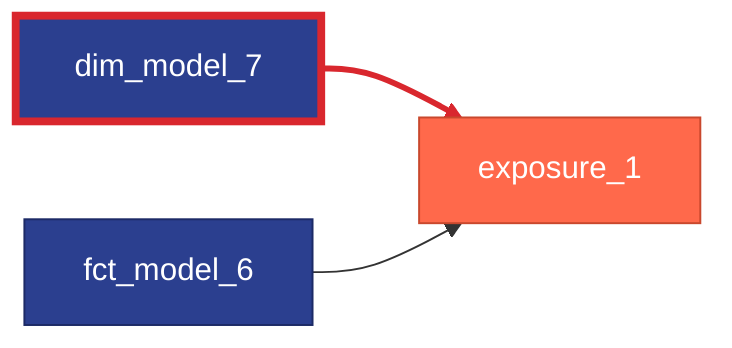

# Governance

Each rule is a native [dbt check](https://docs.getdbt.com/docs/build/checks) that returns one row per violation. Run it with `dbt check <rule_name>`, for example `dbt check fct_public_models_without_contract`.

This set of rules provides checks on your project against dbt Labs' recommended best proactices for adding model governance features.

## Public models without contracts

`fct_public_models_without_contract` ([source](https://github.com/dbt-labs/dbt-project-evaluator/tree/main/checks/governance/fct_public_models_without_contract.sql)) shows each model with `access` configured as public, but is not a contracted model.

**Example**

`report_1` is defined as a public model, but does not have the `contract` configuration to enforce its datatypes.

```yml
# public model without a contract
models:
  - name: report_1
    description: very important OKR reporting model
    access: public

```

**Reason to Flag**

Models with public access are free to be consumed by any downstream consumer. This implies a need for better guarantees around the model's data types and columns. Adding a contract to the model will ensure that the model *always* conforms to the datatypes, columns, and other constraints you expect.

**How to Remediate**

Edit the yml to include the contract configuration, as well as a column entry for all columns output by the model, including their datatype. While not strictly required for defining a contracts, it's best practice to also document each column as well.

```yml
models:
  - name: report_1
    description: very important OKR reporting model
    access: public
    config:
      contract:
        enforced: true
    columns:
      - name: id 
        data_type: integer
```

## Undocumented public models

`fct_undocumented_public_models` ([source](https://github.com/dbt-labs/dbt-project-evaluator/tree/main/checks/governance/fct_undocumented_public_models.sql)) shows each model with `access` configured as public that is not fully documented. This check is similar to `fct_undocumented_models` ([source](https://github.com/dbt-labs/dbt-project-evaluator/tree/main/checks/documentation/fct_undocumented_models.sql)), but is a stricter check that will highlight any public model that does not have a model-level description as well descriptions on each of its columns.

**Example**

`report_1` is defined as a public model, but does not descriptions on the model and each column.

```yml
# public model without documentation
models:
  - name: report_1
    access: public
    columns:
      - name: id

```

**Reason to Flag**

Models with public access are free to be consumed by any downstream consumer. This implies a need for higher standards for the model's usability for those cosumers. Adding more documentation can help consumers understand how they should leverage the data from your public model.

**How to Remediate**

Edit the yml to include a model level description,  as well as a column entry with a description for all columns output by the model. While not strictly required for public models, these should likely also have contracts added as well. (See [above rule](#public-models-without-contracts))

```yml
models:
  - name: report_1
    description: very important OKR reporting model
    access: public
    columns:
      - name: id 
        description: the primary key of my OKR model
```

## Exposures dependent on private models

`fct_exposures_dependent_on_private_models` ([source](https://github.com/dbt-labs/dbt-project-evaluator/tree/main/checks/governance/fct_exposures_dependent_on_private_models.sql)) shows each relationship between a resource and an exposure where the parent resource is not a model with `access` configured as public.

**Example**

Here's a sample DAG that shows direct exposure relationships.



If this were the yml for these two parent models, `dim_model_7` would be flagged by this check, as it is not a public model.

```yml
models:
  - name: fct_model_6
    description: very important OKR reporting model
    access: public
    config:
      materialized: table
      contract:
        enforced: true
    columns:
      - name: id 
        description: the primary key of my OKR model
        data_type: integer
  - name: dim_model_7
    description: excellent model
    access: private
```


**Reason to Flag**

Exposures show how and where your data is being consumed in downstream tools. These tools should read from public, trusted, contracted data sources. All models that are exposed to other tools should have that codified in their `access` configuration.

**How to Remediate**

Edit the yml to include fully expose the models that your exposures depend on. This rule will only flag models that are not `public`, but best practices suggest you should also fully document and contracts these public models as well.

```yml
models:
  - name: fct_model_6
    description: very important OKR reporting model
    access: public
    config:
      materialized: table
      contract:
        enforced: true
    columns:
      - name: id 
        description: the primary key of my OKR model
        data_type: integer
  - name: dim_model_7
    description: excellent model
    access: public
```
