# Modeling

Each rule is a native [dbt check](https://docs.getdbt.com/docs/build/checks) that returns one row per violation. Run it with `dbt check <rule_name>`, for example `dbt check fct_root_models`.

## Direct Join to Source

`fct_direct_join_to_source` ([source](https://github.com/dbt-labs/dbt-project-evaluator/tree/main/checks/modeling/fct_direct_join_to_source.sql)) flags each model that selects from both another model and a source.

**Example**

`int_model_4` is pulling in both a model and a source.

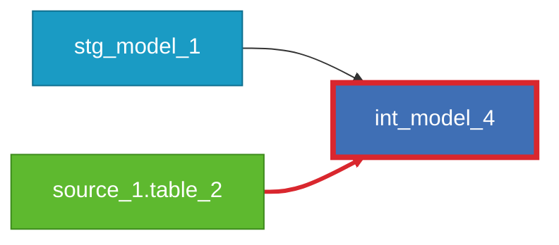

**Reason to Flag**

We highly recommend having a one-to-one relationship between sources and their corresponding `staging` model, and not having any other model reading from the source. Those `staging` models are then the ones read from by the other downstream models.

This allows renaming your columns and doing minor transformation on your source data only once and being consistent
across all the models that will consume the source data.

**How to Remediate**

In our example, we would want to:

1. create a `staging` model for our source data if it doesn't exist already
2. and join this `staging` model to other ones to create our downstream transformation instead of using the source

After refactoring your downstream model to select from the staging layer, your DAG should look like this:

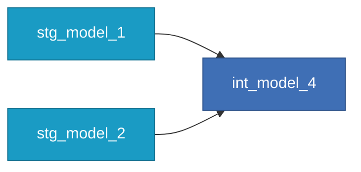

---

## Downstream Models Dependent on Source

`fct_marts_or_intermediate_dependent_on_source` ([source](https://github.com/dbt-labs/dbt-project-evaluator/tree/main/checks/modeling/fct_marts_or_intermediate_dependent_on_source.sql)) shows each downstream model (`marts` or `intermediate`)
that depends directly on a source node.

**Example**

`fct_model_9`, a marts model, builds from `source_1.table_5` a source.


**Reason to Flag**

We very strongly believe that a staging model is the atomic unit of data modeling. Each staging
model bears a one-to-one relationship with the source data table it represents. It has the same
granularity, but the columns have been renamed, recast, or usefully reconsidered into a consistent
format. With that in mind, if a `marts` or `intermediate` type model joins directly to a `{{ source() }}`
node, there likely is a missing model that needs to be added.

**How to Remediate**

Add the reference to the appropriate `staging` model to maintain an abstraction layer between your raw data
and your downstream data artifacts.

After refactoring your downstream model to select from the staging layer, your DAG should look like this:


---

## Duplicate Sources

`fct_duplicate_sources` ([source](https://github.com/dbt-labs/dbt-project-evaluator/tree/main/checks/modeling/fct_duplicate_sources.sql)) returns one row per source node that points at a database object also used by another source node.

**Example**

Imagine you have two separate source nodes - `source_1.table_5` and `source_1.raw_table_5`.

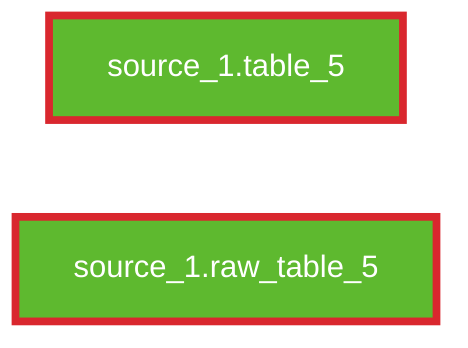

But both source definitions point to the exact same location in your database - `real_database`.`real_schema`.`table_5`.

```yaml
sources:
  - name: source_1
    schema: real_schema
    database: real_database
    tables:
      - name: table_5
      - name: raw_table_5
        identifier: table_5
```

**Reason to Flag**

If you dbt project has multiple source nodes pointing to the exact same location in your data warehouse, you will have an inaccurate view of your lineage.  

**How to Remediate**

Combine the duplicate source nodes so that each source database location only has a single source definition in your dbt project.

---

## Hard Coded References

!!! warning "Not part of v2"

    `fct_hard_coded_references` only exists in 1.x. It needs each model's SQL text, which the information schema available to checks doesn't expose (there is no `raw_code`).
    The closest replacement is the `dbt lint` rule [`DBT05`](https://docs.getdbt.com/reference/commands/lint#dbt-specific-rules) (`dbt.hard_coded_reference`), which you turn on in your own `.sqlfluff` with `rules = DBT05`.
    It does not flag a table name held in a `var()`. See the [README](https://github.com/dbt-labs/dbt-project-evaluator#caveat-hard-coded-references-are-no-longer-covered-by-this-package) for the full comparison.

In 1.x, `fct_hard_coded_references` showed each instance where a model contains hard coded reference(s).

**Example**

`fct_orders` uses hard coded direct relation references (`my_db.my_schema.orders` and `my_schema.customers`).

```sql title="fct_orders.sql"
with orders as (
    select * from my_db.my_schema.orders
),
customers as (
    select * from my_schema.customers
)
select
    orders.order_id,
    customers.name
from orders
left join customers on
  orders.customer_id = customers.id
```

**Reason to Flag**

Always use the `ref` function when selecting from another model and the `source` function when selecting from raw data, rather than using the direct relation reference (e.g. `my_schema.my_table`). In 1.x, direct relation references were detected with a regex.

The `ref` and `source` functions are part of what makes dbt so powerful! Using these functions allows dbt to infer dependencies (and check that you haven't created any circular dependencies), properly generate your DAG, and ensure that models are built in the correct order. This also ensures that your current model selects from upstream tables and views in the same environment that you're working in.

**How to Remediate**

For each hard coded reference:

- if the hard coded reference is to a model, update the sql to instead use the [ref](https://docs.getdbt.com/reference/dbt-jinja-functions/ref) function
- if the hard coded reference is to raw data, create any needed [sources](https://docs.getdbt.com/docs/build/sources#declaring-a-source) and update the sql to instead use the [source](https://docs.getdbt.com/reference/dbt-jinja-functions/source) function

For the above example, our updated `fct_orders.sql` file would look like:

``` sql title="fct_orders.sql"
with orders as (
    select * from {{ ref('orders') }}
),
customers as (
    select * from {{ ref('customers') }}
)
select
    orders.order_id,
    customers.name
from orders
left join customers on
  orders.customer_id = customers.id
```

---

## Model Fanout

`fct_model_fanout` ([source](https://github.com/dbt-labs/dbt-project-evaluator/tree/main/checks/modeling/fct_model_fanout.sql)) flags every model with at least `models_fanout_threshold` (default 3) direct leaf children. A leaf is a model with no children of its own; tests, exposures, metrics and saved queries don't count as children.
You can set your own threshold for model fanout by overriding the `models_fanout_threshold` variable. [See overriding variables section.](../customization/overriding-variables.md)

**Example**

`fct_model` has three direct leaf children.

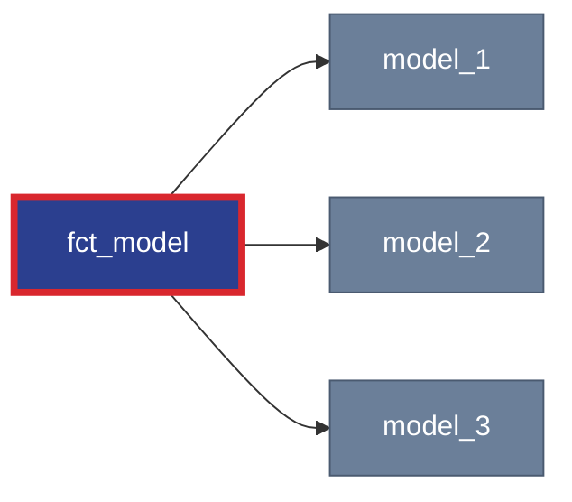

**Reason to Flag**

This might indicate some transformations should move to the BI layer, or a common business transformations
should be moved upstream.

**Exceptions**

Some BI tools are better than others at joining and data exploration. For example, with Looker you could
end your DAG after marts (i.e. fcts & dims) and join those artifacts together (with a little know how
and setup time) to make your reports. For others, like Tableau, model fanouts might be more
beneficial, as this tool prefers big tables over joins, so predefining some reports is usually more performant.

To exclude specific cases, check out the instructions in [Configuring exceptions to the rules](../customization/exceptions.md).

**How to Remediate**

Queries and transformations can move around between dbt and the BI tool, so how do we try to stay
effortful in what we decide to put where?

You can think of dbt as our assembly line which produces expected outputs every time.

You can think of the BI layer as the place where we take the items produced from our assembly line to
customize them in order to meet our stakeholder's needs.

<!---
TODO: edit this line in 6 months after more progress is made on the metrics server
-->
Your dbt project needs a defined end point! Until the metrics server comes to fruition, you cannot possibly
predefine every query or quandary your team might have. So decide as a team where that line is and maintain it.

---

## Multiple Sources Joined

`fct_multiple_sources_joined` ([source](https://github.com/dbt-labs/dbt-project-evaluator/tree/main/checks/modeling/fct_multiple_sources_joined.sql)) flags each model or snapshot that references more than one source.

**Example**

`stg_model_2` references two source tables.

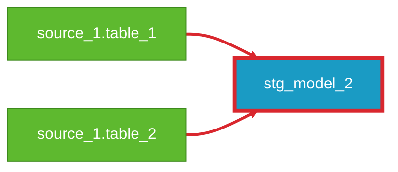

**Reason to Flag**

We very strongly believe that a staging model is the atomic unit of data modeling. Each staging
model bears a one-to-one relationship with the source data table it represents. It has the same
granularity, but the columns have been renamed, recast, or usefully reconsidered into a consistent
format. With that in mind, two `{{ source() }}` declarations in one staging model likely means we are
not being composable enough and there are individual building blocks which could be broken out into
their respective models.

**Exceptions**

Sometimes companies have a bunch of [identical sources across systems](https://discourse.getdbt.com/t/unioning-identically-structured-data-sources/921). When these identical sources will only ever be used collectively, you should union them once and create a staging layer on the combined result.

To exclude specific cases, check out the instructions in [Configuring exceptions to the rules](../customization/exceptions.md).

**How to Remediate**

In this example specifically, those raw sources, `source_1.table_1` and `source_1.table_2` should each
have their own staging model (`stg_model_1` and `stg_model_2`), as transitional steps, which will
then be combined into a new `int_model_2`. Alternatively, you could keep `stg_model_2` and add
`base__` models as transitional steps.

To fix this, try out the [codegen](https://hub.getdbt.com/dbt-labs/codegen/latest/) package! With
this package you can dynamically generate the SQL for a staging (what they call base) model, which
you will use to populate `stg_model_1` and `stg_model_2` directly from the source data. Create a
new model `int_model_2`. Afterwards, within `int_model_2`, update your `{{ source() }}` macros to
`{{ ref() }}` macros and point them to your newly built staging models. If you had type casting,
field aliasing, or other simple improvements made in your original `stg_model_2` SQL, then attempt
to move that logic back to the new staging models instead. This will help colocate those
transformations and avoid duplicate code, so that all downstream models can leverage the same
set of transformations.

Post-refactor, your DAG should look like this:

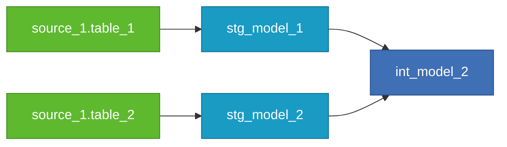

or if you want to use base_ models and keep stg_model_2 as is:

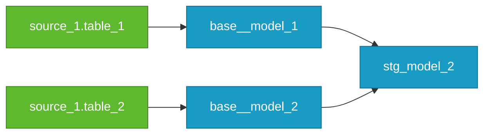

---

## Rejoining of Upstream Concepts

`fct_rejoining_of_upstream_concepts` ([source](https://github.com/dbt-labs/dbt-project-evaluator/tree/main/checks/modeling/fct_rejoining_of_upstream_concepts.sql)) contains all cases where one of the parent's direct children
is ALSO the direct child of ANOTHER one of the parent's direct children. Only includes cases
where the model "in between" the parent and child has NO other downstream dependencies.

**Example**

`stg_model_1`, `int_model_4`, and `int_model_5` create a "loop" in the DAG. `int_model_4` has no other downstream dependencies other than `int_model_5`.

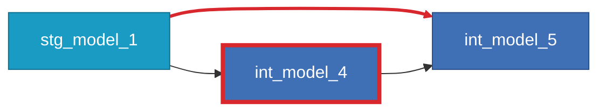

**Reason to Flag**

This could happen for a variety of reasons: Accidentally duplicating some business concepts in multiple
data flows, hesitance to touch (and break) someone else’s model, or perhaps trying to snowflake out
or modularize everything without awareness of what will help build time.

As a general rule, snowflaking out models in a thoughtful manner allows for concurrency, but in this
example nothing downstream can run until `int_model_4` finishes, so it is not saving any time in
parallel processing by being its own model. Since both `int_model_4` and `int_model_5` depend solely
on `stg_model_1`, there is likely a better way to write the SQL within one model (`int_model_5`) and
simplify the DAG, potentially at the expense of more rows of SQL within the model.

**Exceptions**

The one major exception to this would be when using a function from
[dbt_utils](https://hub.getdbt.com/dbt-labs/dbt_utils/latest/) package, such as `star` or `get_column_values`,
(or similar functions / packages) that require a [relation](https://docs.getdbt.com/reference/dbt-classes#relation)
as an argument input. If the shape of the data in the output of `stg_model_1` is not the same as what you
need for the input to the function within `int_model_5`, then you will indeed need `int_model_4` to create
that relation, in which case, leave it.

To exclude specific cases, check out the instructions in [Configuring exceptions to the rules](../customization/exceptions.md).

**How to Remediate**

Barring jinja/macro/relation exceptions we mention directly above, to resolve this, simply bring the SQL contents from `int_model_4` into a CTE within `int_model_5`, and swap all `{{ ref('int_model_4') }}` references to the new CTE(s).

Post-refactor, your DAG should look like this:

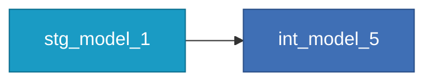

---

## Root Models

`fct_root_models` ([source](https://github.com/dbt-labs/dbt-project-evaluator/tree/main/checks/modeling/fct_root_models.sql)) shows each model with 0 direct parents, meaning that the model cannot be traced back to a declared source or model in the dbt project.

**Example**

`model_4` has no direct parents

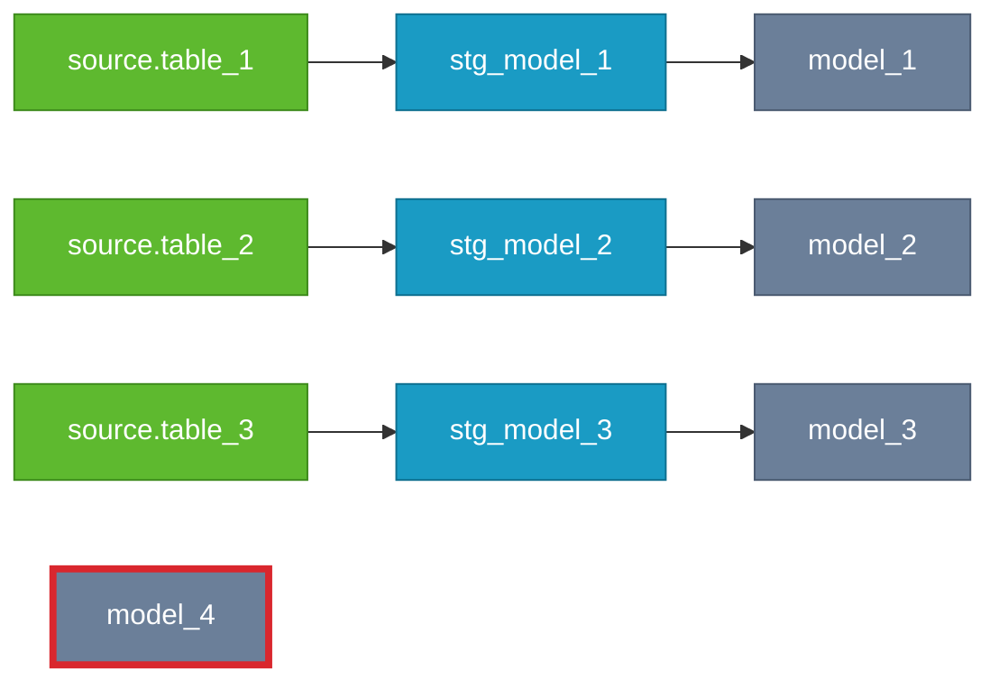

**Reason to Flag**

This likely means that the model (`model_4`  below) contains raw table references, either to a raw data source, or another model in the project without using the `{{ source() }}` or `{{ ref() }}` functions, respectively. This means that dbt is unable to interpret the correct lineage of this model, and could result in mis-timed execution and/or circular references depending on the model’s upstream dependencies.

**Exceptions**

This behavior may be observed in the case of a manually defined reference table that does not have any dependencies. A good example of this is a `dim_calendar` table that is generated by the `{{ dbt_utils.date_spine() }}` macro — this SQL logic is completely self contained, and does not require any external data sources to execute.

To exclude specific cases, check out the instructions in [Configuring exceptions to the rules](../customization/exceptions.md).

**How to Remediate**

Start by mapping any table references in the `FROM` clause of the model definition to the models or raw tables that they draw from, and replace those references with the `{{ ref() }}` if the dependency is another dbt model, or the `{{ source() }}` function if the table is a raw data source (this may require the declaration of a new source table). Then, visualize this model in the DAG, and refactor as appropriate according to best practices.

---

## Source Fanout

`fct_source_fanout` ([source](https://github.com/dbt-labs/dbt-project-evaluator/tree/main/checks/modeling/fct_source_fanout.sql)) shows each instance where a source is the direct parent of multiple resources in the DAG.

**Example**

`source_1.table_1` has more than one direct child model.

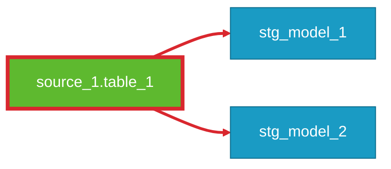

**Reason to Flag**

Each source node should be referenced by a single model that performs basic operations, such as renaming, recasting, and other light transformations to maintain consistency through out the project. The role of this staging model is to mirror the raw data but align it with project conventions. The staging model should act as a source of truth and a buffer- any model which depends on the data from a given source should reference the cleaned data in the staging model as opposed to referencing the source directly. This approach keeps the code DRY (any light transformations that need to be done on the raw data are performed only once). Minimizing references to the raw data will also make it easier to update the project should the format of the raw data change.

**Exceptions**

NoSQL databases or heavily nested data sources often have so much info json packed into a table
that you need to break one raw data source into multiple base models.

To exclude specific cases, check out the instructions in [Configuring exceptions to the rules](../customization/exceptions.md).

**How to Remediate**

Create a staging model which references the source and cleans the raw data (e.g. renaming, recasting). Any models referencing the source directly should be refactored to point towards the staging model instead.

After refactoring the above example, the DAG would look something like this:

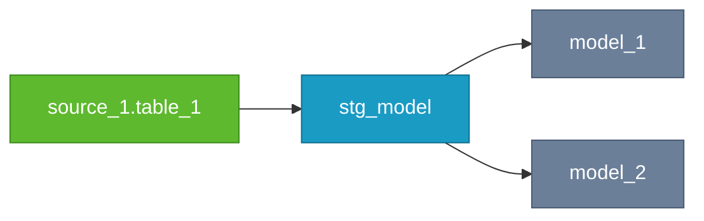

---

## Staging Models Dependent on Downstream Models

`fct_staging_dependent_on_marts_or_intermediate` ([source](https://github.com/dbt-labs/dbt-project-evaluator/tree/main/checks/modeling/fct_staging_dependent_on_marts_or_intermediate.sql)) shows each staging model that depends on an intermediate or marts model, as defined by the naming conventions and folder paths specified in your project variables.

**Example**

`stg_model_5`, a staging model, builds from `fct_model_9` a marts model.

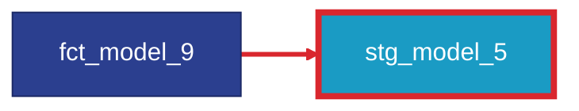

**Reason to Flag**

This likely represents a misnamed file. According to dbt best practices, staging models should only
select from source nodes. Dependence on downstream models indicates that this model may need to be either
renamed, or reconfigured to only select from source nodes.

**How to Remediate**

Rename the file of the model in the `name` column to use the appropriate prefix, or change the models lineage
by pointing the staging model to the appropriate `{{ source() }}`.

After updating the model to use the appropriate `{{ source() }}` function, your graph should look like this:


## Staging Models Dependent on Other Staging Models

`fct_staging_dependent_on_staging` ([source](https://github.com/dbt-labs/dbt-project-evaluator/tree/main/checks/modeling/fct_staging_dependent_on_staging.sql)) flags each staging model (`name`) that depends on another staging model (`parent`).

**Example**

`stg_model_2` is a parent of `stg_model_4`.

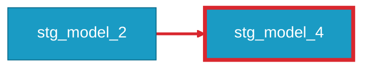

**Reason to Flag**

This may indicate a change in naming is necessary, or that the child model should instead reference a source.

**How to Remediate**

You should either change the model type of the flagged model (maybe to an intermediate or marts model) or change the child's lineage instead reference the appropriate `{{ source() }}`.

In our example, we might realize that `stg_model_4` is _actually_ an intermediate model. We should move this file to the appropriate intermediate directory and update the file name to `int_model_4`.

---

## Unused Sources

`fct_unused_sources` ([source](https://github.com/dbt-labs/dbt-project-evaluator/tree/main/checks/modeling/fct_unused_sources.sql)) flags each source with no children (tests don't count as children).

**Example**

`source_1.table_4` isn't being referenced.

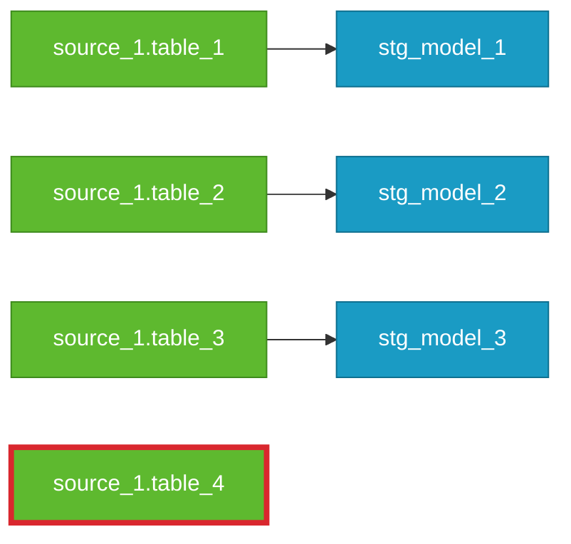

**Reason to Flag**

This represents either a source that you have defined in YML but never brought into a model or a
model that was deprecated and the corresponding rows in the source block of the YML file were
not deleted at the same time. This simply represents the buildup of cruft in the project that
doesn’t need to be there.

**How to Remediate**

Navigate to the `sources.yml` file (or whatever your company has called the file) that corresponds
to the unused source. Within the YML file, remove the unused table name, along with descriptions
or any other nested information.

  ```yaml title="sources.yml"
  sources:
    - name: some_source
      database: raw
      tables:
        - name: table_1
        - name: table_2
        - name: table_3
        - name: table_4  # <-- remove this line
  ```

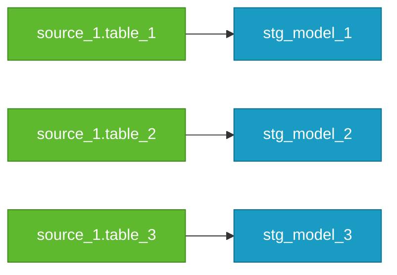

---

## Models with Too Many Joins

`fct_too_many_joins` ([source](https://github.com/dbt-labs/dbt-project-evaluator/tree/main/checks/modeling/fct_too_many_joins.sql)) flags models with at least `too_many_joins_threshold` direct parents (models or sources). The threshold is 7 by default and you can set your own by overriding the `too_many_joins_threshold` variable. [See overriding variables section.](../customization/overriding-variables.md)

**Example**

`fct_model_1` directly references seven (7) staging models upstream.

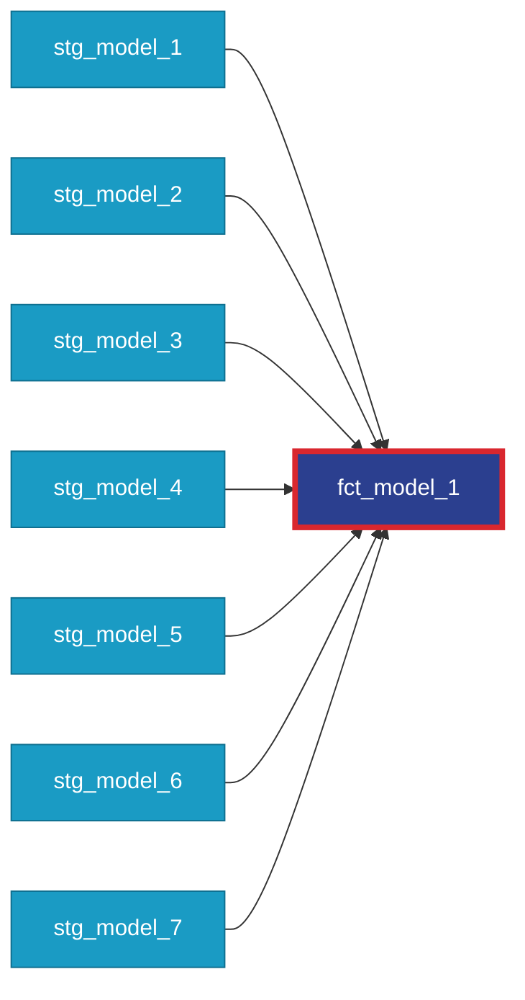

**Reason to Flag**

This likely represents a model in which too much is being done. Having a model that too many upstream models introduces a lot of code complexity, which can be challenging to understand and maintain.

**How to Remediate**

Bringing together a reasonable number (typically 4 to 6) of entities or concepts (staging models, or perhaps other intermediate models) that will be joined with another similarly purposed intermediate model to generate a mart. Rather than having too many joins, we can join two intermediate models that each house a piece of the complexity, giving us increased readability, flexibility, testing surface area, and insight into our components.

```mermaid
flowchart LR
    classDef staging fill:#1a9bc4,stroke:#0e6f8f,color:#fff
    classDef intermediate fill:#3f6fb5,stroke:#2a4f87,color:#fff
    classDef marts fill:#2b3f8f,stroke:#1c2a66,color:#fff
    stg_model_1["stg_model_1"]:::staging
    int_model_1["int_model_1"]:::intermediate
    stg_model_2["stg_model_2"]:::staging
    stg_model_3["stg_model_3"]:::staging
    stg_model_4["stg_model_4"]:::staging
    stg_model_5["stg_model_5"]:::staging
    int_model_2["int_model_2"]:::intermediate
    stg_model_6["stg_model_6"]:::staging
    stg_model_7["stg_model_7"]:::staging
    fct_model_1["fct_model_1"]:::marts
    stg_model_1 --> int_model_1
    stg_model_2 --> int_model_1
    stg_model_3 --> int_model_1
    stg_model_4 --> int_model_1
    stg_model_5 --> int_model_2
    stg_model_6 --> int_model_2
    stg_model_7 --> int_model_2
    int_model_1 --> fct_model_1
    int_model_2 --> fct_model_1
```
