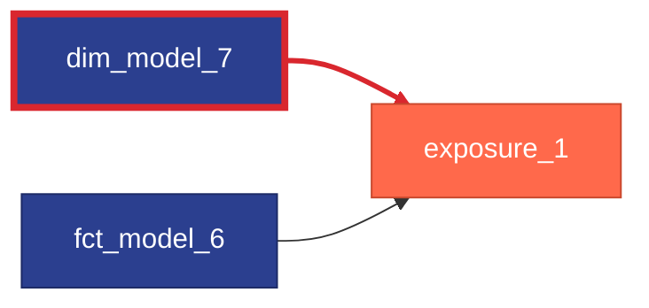

# Performance

Each rule is a native [dbt check](https://docs.getdbt.com/docs/build/checks) that returns one row per violation. Run it with `dbt check <rule_name>`, for example `dbt check fct_chained_views_dependencies`.

## Chained View Dependencies

`fct_chained_views_dependencies` ([source](https://github.com/dbt-labs/dbt-project-evaluator/tree/main/checks/performance/fct_chained_views_dependencies.sql)) contains models that are dependent on chains of "non-physically-materialized" models (views and ephemerals), highlighting potential cases for improving performance by switching the materialization of model(s) within the chain to table or incremental.

This check warns (by default) on `dbt check` and `dbt build` if the `distance` between a given `parent` and `child` is greater than `chained_views_threshold` (default 5).
You can set your own threshold for chained views by overriding the `chained_views_threshold` variable. [See overriding variables section.](../customization/overriding-variables.md)

**Example**

`table_1` depends on a chain of 4 views (`view_1`, `view_2`, `view_3`, and `view_4`). The chain is flagged here because `chained_views_threshold` is lowered to 3 for this example.

**Reason to Flag**

You may experience a long runtime for a model when it is build on top of a long chain of "non-physically-materialized" models (views and ephemerals). In the example above, nothing is really computed until you get to `table_1`. At which point, it is going to run the query within `view_4`, which will then have to run the query within `view_3`, which will then have the run the query within `view_2`, which will then have to run the query within `view_1`. These will all be running at the same time, which creates a long runtime for `table_1`.

**How to Remediate**

We can reduce this compilation time by changing the materialization strategy of some key upstream models to table or incremental to keep a minimum amount of compute in memory and preventing nesting of views. If, for example, we change the materialization of `view_4` from a view to a table, `table_1` will have a shorter runtime as it will have less compilation to do.

The best practice to determine top candidates for changing materialization from `view` to `table`:

- if a view is used downstream my *many* models, change materialization to table
- if a view has more complex calculations (window functions, joins between *many* tables, etc.), change materialization to table

## Exposure Parents Materializations

`fct_exposure_parents_materializations` ([source](https://github.com/dbt-labs/dbt-project-evaluator/tree/main/checks/performance/fct_exposure_parents_materializations.sql)) highlights instances where the resources referenced by exposures are either:

1. a `source`
2. a `model` that does not use the `table` or `incremental` materialization

**Example**

In this case, the parents of `exposure_1` are not both materialized as tables -- `dim_model_7` is ephemeral, while `fct_model_6` is a table. This check would return a row for the `dim_model_7 --> exposure_1` relationship.

**Reason to Flag**

Exposures should depend on the business logic you encoded into your dbt project (e.g. models or metrics) rather than raw untransformed sources. Additionally, models that are referenced by an exposure are likely to be used heavily in downstream systems, and therefore need to be performant when queried.

**How to Remediate**

If you have a source parent of an exposure, you should incorporate that raw data into your project in some way, then update the exposure to point to that model.

If necessary, update the `materialized` configuration on the models returned by `fct_exposure_parents_materializations` to either `table` or `incremental`. This can be done in individual model files using a config block, or for groups of models in your `dbt_project.yml` file. See the docs on [model configurations](https://docs.getdbt.com/reference/model-configs) for more info!
